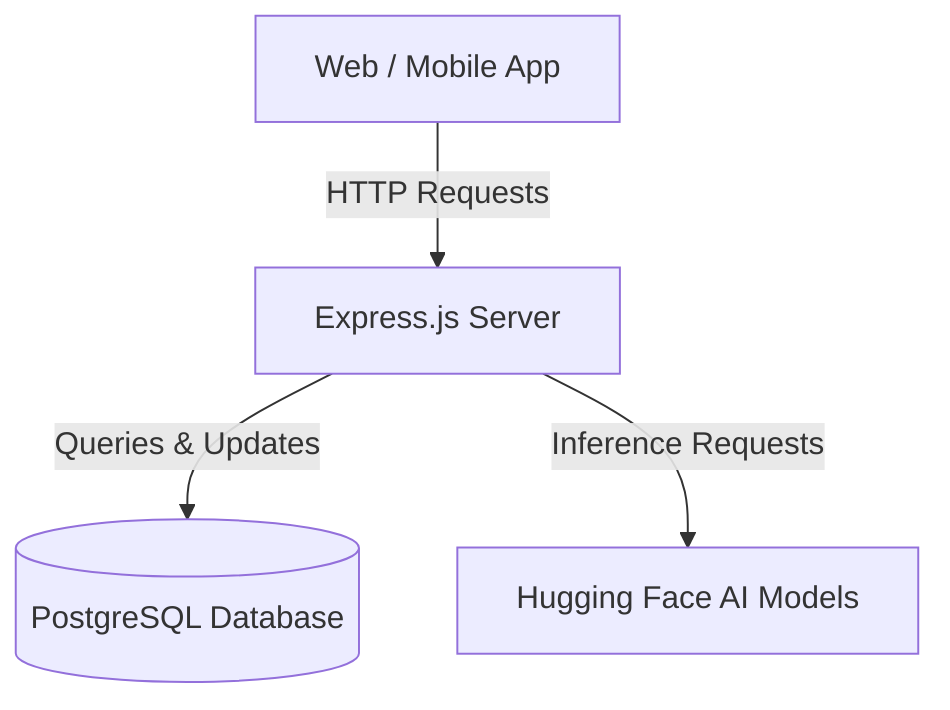

# HeartGuard Backend Architecture Guide

This guide is designed to help students understand the backend architecture of the HeartGuard application. It covers the data flow, database structure, file roles, and how the backend acts as the central nervous system connecting the frontend, mobile app, and AI models.

---

## 1. High-Level Backend Flow
The backend of HeartGuard is built using **Node.js** and **Express.js**. Its primary job is to serve as the secure middleman between the User Interfaces (React Web & Flutter Mobile), the Database (PostgreSQL), and the AI Models (Hugging Face).

### The Request Lifecycle
1. **Request:** The frontend sends an HTTP request (e.g., `POST /api/assessment` with vitals and an ECG image).
2. **Middleware:** The request passes through security and parsing middleware (e.g., `cors`, `cookie-parser`, `multer` for images, and `requireAuth` to verify the user is logged in).
3. **Routing:** Express routes the request to the correct handler based on the URL.
4. **Business Logic & AI:** The backend gathers necessary historical data from the database, formats it, and sends it to the AI endpoint.
5. **Database Interaction:** The AI's response is parsed and securely saved into PostgreSQL.
6. **Response:** The backend formats a JSON response and sends it back to the frontend to be displayed.

---

## 2. The Database Structure (PostgreSQL)
The database is fully relational, meaning data is strictly organized and linked together using Foreign Keys (specifically `UUID`s for security). 

* **`users`**: The core table. Stores `email` and heavily encrypted `password_hash`.
* **`sessions`**: Maps a secure, random `token` (stored in the user's browser cookie) to a specific `user_id`.
* **`user_profiles` / `lifestyle_data` / `medical_history`**: These tables store the onboarding data. They are split into multiple tables to keep the data normalized and organized.
* **`risk_assessments`**: Stores the results of every AI assessment. Notice how it saves *both* the raw inputs (cholesterol, bmi) and the AI outputs (risk_score, recommendations).
* **`chat_sessions` & `chat_messages`**: Stores conversation history so the AI can remember what the user said earlier in the chat.

### How the Database is Created
The database structure is initially defined in the `heartguard-schema.sql` file. This file acts as the primary blueprint. When deploying the application to a new environment (like Neon.tech or a local PostgreSQL instance), the administrator manually executes this script one time to create all the empty tables, columns, constraints, and indexes.

### How We Check or Modify the Database
1. **Manual Inspection (pgAdmin / Neon SQL Editor):** To view the actual data inside the database (e.g., checking if a user registered successfully or viewing raw assessment data), developers use GUI database tools like **pgAdmin 4** (for local databases) or the Neon.tech dashboard (for cloud databases). These tools allow you to run raw SQL commands like `SELECT * FROM risk_assessments;`.
2. **Automatic Code Migrations (`server/index.ts`):** When the developers need to modify the database structure (for example, adding a new `ecg_file_url` column), they use programmatic migrations. Inside the `server/index.ts` file, there is an `ALTER TABLE ... ADD COLUMN IF NOT EXISTS` block. Every time the Node.js server starts, it automatically connects to the database and applies these modifications. This ensures the live database is always perfectly synced with the backend code's requirements without requiring manual intervention.
---

## 3. Key Files and Their Roles

Here is a breakdown of the most critical files in the `server/` directory and what they do:

### `server/index.ts` (The Entry Point)
This is the brain of the backend. 
* It configures **Middleware** (allowing cross-origin requests, parsing JSON, and reading cookies).
* It defines the **API Routes** (`/api/auth`, `/api/assessment`, etc.).
* **Migration Logic:** On startup, it runs an `ALTER TABLE` script to ensure the database schema is up-to-date.
* **Vercel Integration:** It exports the `app` so it can run as a Serverless Function on the cloud, or locally via `app.listen()`.

### `server/db.ts` (The Database Connection)
* Uses the `pg` (node-postgres) library to create a **Connection Pool**. 
* Instead of opening and closing a database connection for every single request (which is slow), a "Pool" keeps several connections open and reuses them for efficiency.

### `server/middleware/auth.ts` (The Security Gatekeeper)
* Contains the `requireAuth` function. 
* Whenever a route is protected (like submitting an assessment), this code runs *first*. It checks if the user's request contains a valid session cookie. If the cookie is missing or invalid, it rejects the request with a `401 Unauthorized` error before the main code even runs.

### `server/routes/auth.ts` (Authentication)
* Handles user registration and login.
* **Important Detail:** It uses `bcryptjs` to hash passwords. A plain-text password is *never* saved to the database. It also generates secure session tokens and sets them as `HttpOnly` cookies, which prevents hackers from stealing the token using JavaScript (XSS attacks).

### `server/routes/assessment.ts` (The Assessment Engine)
This is the most complex file in the project.
1. **Multer:** Uses `multer` to intercept incoming file uploads (the ECG image) and store it in RAM.
2. **Data Aggregation:** It queries the database for the user's age, smoking habits, and medical history.
3. **AI Communication:** It bundles the image and the historical data into a `FormData` object and sends it to the custom Hugging Face endpoint (`Qwen2.5 72B Instruct`).
4. **Resilience (Fallback):** It includes a `calculateRiskScore()` function. If the AI server goes down or times out, the backend calculates a basic algorithmic risk score so the user's app doesn't crash.

### `server/routes/chat.ts` (The AI Chatbot)
* Connects directly to Hugging Face using the `@huggingface/inference` SDK.
* **Context Management:** When a user sends a message, this file queries the `chat_messages` table to pull the last 12 messages. It feeds this entire history to the AI so the AI "remembers" the context of the conversation.

---

## 4. Authentication Flow (Register & Login Example)

To help students understand how data moves from the user's screen into the database, let's trace the Registration and Login flows.

### Example A: Registration (Sign Up)
1. **Frontend Input:** The user types their `email`, `password`, and `full_name` into the React/Flutter form and clicks "Sign Up".
2. **The Request:** The frontend sends a `POST` request to `/api/auth/register` with a JSON body containing those three fields.
3. **Backend Processing (`server/routes/auth.ts`):**
   * The backend extracts the data from `req.body`.
   * It checks if the email already exists in the `users` table (`SELECT * FROM users WHERE email = $1`). If it does, it returns an error.
   * **Security Step:** It hashes the password using `bcryptjs`. It takes the plain-text password (e.g., `"password123"`) and turns it into a scrambled hash (e.g., `"$2a$10$X8...n9"`).
4. **Database Insertion:** The backend runs an `INSERT INTO users (email, password_hash, full_name)` query, saving the *hashed* password to the database.
5. **Session Creation:** The backend generates a random `token`, saves it into the `sessions` table linked to this new user's ID, and sends it back to the frontend as an HTTP-only cookie.

### Example B: Login
1. **Frontend Input:** The user types their `email` and `password` and clicks "Login".
2. **The Request:** The frontend sends a `POST` request to `/api/auth/login`.
3. **Backend Processing:**
   * The backend queries the database: `SELECT * FROM users WHERE email = $1`.
   * It retrieves the `password_hash` saved during registration.
   * **Security Step:** It uses `bcrypt.compare()` to mathematically verify if the typed password matches the hash. 
4. **Database Insertion (Session):** If the password is correct, the backend creates a brand-new session token and runs an `INSERT INTO sessions (user_id, token, expires_at)` query.
5. **Response:** The backend sends the new token back to the browser as a cookie. For all future requests (like submitting an assessment), the browser automatically includes this cookie, and the `requireAuth` middleware checks the `sessions` table to verify who is making the request.

---

## 5. How the Backend Relates to Other Tracks

### To Frontend Web (React / Vite)
The backend provides a standardized REST API (`/api/...`). The frontend developers don't need to know *how* the database works or *how* the AI is queried; they just need to know what JSON to send and what JSON they will receive. The backend also serves the compiled React application when running in production.

### To Frontend Mobile (Flutter)
The mobile app relies entirely on this backend. While the React web app uses cookies for authentication, mobile apps usually manage tokens manually. The backend is designed to accept requests from `localhost:5000` (Web) or `10.0.2.2` (Android Emulator) simultaneously via CORS (Cross-Origin Resource Sharing).

### To AI (Hugging Face)
The backend acts as the secure intermediary. If the frontend talked directly to Hugging Face, you would have to put your `HUGGINGFACE_API_TOKEN` in the frontend code, meaning anyone could steal it. By routing AI requests through the backend, the API token remains safely hidden on the server, and the backend can aggressively format the prompts and data before the AI sees it.

---

## 6. Summary for Students
When explaining this to students, emphasize the concept of **Separation of Concerns**:
1. **The Database** strictly stores information.
2. **The AI** strictly analyzes information.
3. **The Frontend/Mobile** strictly displays information.
4. **The Backend** is the conductor that safely moves the information between the other three.
